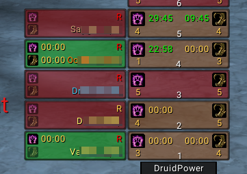

# DruidPower
Raid/Group Druid buff helper. Heavily inspired by PallyPower.

## Usage
- `Left Click:` Mark of the Wild
- `Shift + Left Click:` Gift of the Wild
- `Right Click:` Thorns
- `Mouse Wheel Scroll:` Assign/Unassign Thorns

### Group Frame
- Colors
  - Red: Everyone is missing buffs
  - Yellow: Some are missing buffs
  - Green: Everyone is buffed
- Number bottom center is the group number
- Yellow number below the buff icons indicates how many people are missing that buff
- Duration displays the lowest duration in that group

Clicking on the group frame will rotate its target through the group members on each click. It ignores people that are out of range, dead, afk or offline.

### Player Frame
- `R` is the range indicator
  - Green: In range
  - Yellow: Out of spell range but in render range
  - Red: Out of range
- `D` indicates that player is dead
- `OFF` indicates that the player is offline
- Tanks have a shield icon
- Duration of `00:00` means the target has the buff but the client does not supply its duration, usually happens when the target is not in render range

## Chat Commands
- `/druidpower` or `/druidpower anchor` Toggles the anchor on and off
- `/druidpower reset` Moves the frame back to its default postion(center of the screen)
